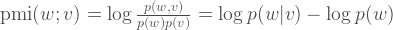

##What is exacloud?

[Exacloud](http://exainfo.ohsu.edu) is OHSU's cluster computing environment. It currently has over 6000 CPUs of varying capabilities and memory that can be utilized by users who want to run parallel computing jobs.

However, to run jobs effectively on exacloud, you must understand some basic techniques and how exacloud works.

##Architecture of exacloud

Essentially, you can think of exacloud as divided into two different node types: the first is the *head node*, which is the node that you sign into initially into exacloud. The head node handles all of the scheduling and file transfer to the other nodes in the system. The other nodes are subservient *compute nodes*.

How does the head node tell the compute nodes what to do? There is a program called HTCondor (currently version 8.0.6 on exacloud) that schedules computing jobs for all of the nodes on exacloud. How does it decide which jobs to run on which nodes?

You might wonder if you need to load all of your data onto each node that you run your jobs on. The short answer is no, because exacloud has a distributed filesystem called Lustre. Essentially when you copy a file onto Lustre, the file gets copied in such a way across nodes that it is easily accessible by each node. The drawback to Lustre is that it is currently difficult to maintain and can be prone to data loss.

For this reason, do *not* use Lustre for long term storage of your data! It's better to transfer your files off of Lustre when you're done.

##Our Goal for Today

We will be reproducing the following analysis using data pulled from the twitter feed: [On Geek Versus Nerd](https://slackprop.wordpress.com/2013/06/03/on-geek-versus-nerd/). We want to discover the words that co-occur with "nerd" and "geek" with high frequency in a corpus of tweets.



Essentially, we need to calculate the probability of our two words of interest. Then for every other word, we calculate the probability of co-occurence with one of our words.

We're going to do the counting by splitting our twitter corpus (fulldata.csv) into multiple files. Then we'll run the pmi.py script to produce counts for each of these files. The stitchpmi script will take the output from running the scripts, put them together, and calculate the probabilities for each word to produce the final PMI score.

Other fun pairs of words you might want to use:
  * "british" and "american"
  * "love" and "hate"
  * "tweet" and "post"

We will be achieving this by executing 5 tasks, which is the standard workflow for setting up exacloud runs.

1. First we will test our code in an interactive session.
2. Then, we will split our data up into individual files.
3. Next, we will set up the submit script to specify how to run our scripts on these individual files.
4. Then we run our job on exacloud.
5. Then we'll open another interactive session to knit our results back together and produce the pmi scores. In this same session, we'll run a simple R script to plot our interesting results.

##Task 0: Getting onto exacloud and understanding the lustre filesystem

Before you can even start with exacloud, you need an exacloud login and password. You will need to talk with ACC for an account and password.

1. To connect with exacloud, use the ssh command and input your password when prompted:

```
ssh USERNAME@exacloud.ohsu.edu
```

2. Your entry point is the ACC (Advanced Computing Center) filesystem, which is shared across all ACC machines (not just exacloud). You can run jobs from here, but you will run into space limitations (10 Gb limit). If you have larger data, it's much easier to use the lustre filesystem. So let's go to the lustre folder:

```
cd /home/exacloud/lustre1/[our folder name]
```

3. Make your own folder in the lustre folder. Copy the scripts, and example data into your folder.

```
mkdir [your user name]
cp
```

##Task 1: Testing your code in an interactive session

**IMPORTANT:** Do not run jobs on the head node! You will be yelled at, and for good reason. The head node is a very busy node, handling job scheduling and file transfer for the entire cluster. If you run jobs on it, you essentially are slowing everyone else down.

Instead, you can test your jobs by opening up an interactive session on exacloud. Essentially, opening up an interactive session guarantees the use of a particular node on exacloud. You can run jobs in an interactive session on the command line, which is what we're are going to do. It's also useful when you just need compute time for short jobs that don't need to be parallelized.

1. Open an interactive session using condor_submit. It may take a few seconds for the interactive session to open up, so be patient.
```
condor_submit -interactive
```
2. Take a look at the n-gram script (*pmi.py*). What are the functions?
3. Modify the two analysis words (the variables are named "woi1" and "woi2").
4. We will be testing out the n-gram counting script on the test data ('test.csv'). Take a look at it. What is the structure of the file. Which column are the tweets in?
5. Let's try running the script:
```
python pmi.py test.csv
```
6. What is the output of the python script? How is it named? (list the contents of your folder if you're not sure).
Note: To leave your interactive session, use the exit command. You'll return back to the head node. Don't leave it just yet, as we'll use the interactive session to split up your file (Task 2)

##Task 2: Splitting up your problem

We'll be using the unix command split to split our 1 and 2-gram task up into 50 smaller tasks using the -n option. Using the -d option, the output of split will be numeric.

1. Run the split command on the training file in your directory.
```
#numeric-suffixes argument is so split doesn't label the files alphabetically (xaa, xab, xac, etc)
split --numeric-suffixes --lines=200000 fulldata.csv
```
```
#awk command to split fulldata into files of 200000 lines and numbered sequentially with prefix "data"
awk 'NR%200000==1{i=0;x="data"++i;}{print > x}' fulldata.csv
```

2. List the contents of your directory. How many files did you make using the split command? Remember this number.
```
ls -l
```

###Extension: Using multiple directories to divide your jobs

If you have multiple files to process at a time, another alternative is to set up numbered directories where each file has the identical name. This affects how you set up your submit script.

Sometimes, however, you have to run scripts where everything is hard-coded.

##Task 3: Setting up your submit script to HTCondor

1. While still in your interactive session, look at "pmi.submit" using a text editor such as nano.
```
nano pmi.submit
```
2. Set the N variable to the number of files you want to process (you did remember this number, right?).
3. We are going to be using the built in looping mechanism in HTCondor to run the pmi.py script on each file separately. Look at the "arguments" line. We use the built in $(Process) variable to select which file to run.
4. If you want to be notified by email, fill out your email in the notify_user line and uncomment it (remove the "#" at the beginning of the line).
5. Exit the interactive session using `exit`. We need to be in the head node to now submit our script.

###Extension: Asking for machines with specific requirements

HTCondor has a 'classified' system that allows you to request specific processing and memory requirements for your job. You can specify parameters such as [].

###Extension: Writing a script that generates a submit script

There are other ways to write submit scripts. For example, if your job requires cycling through a list of non-standard files that are not sequentially numbered, this is the best way to process them. (Later versions of HTCondor allow you to use the Queue command to handle different file names.)

For example, we can run the submit script for three different files called "april.csv", "may.csv", and "june.csv" by writing a program to build the following submit script. Note we set some parameters at the beginning and then change the arguments parameter to run the script for each file name. The Queue command starts the job.

```
#Example submit script for running on multiple files
#you can easily write a python script to generate such a script!
universe = vanilla
#set the executable here (could be a shell script, software, anything)
executable = /usr/bin/python
when_to_transfer_output = ON_EXIT
#uncomment and fill out your username to get
#notify_user = yourname@ohsu.edu

arguments = "pmi.py april.csv"
Queue

arguments = "pmi.py may.csv"
Queue

arguments = "pmi.py july.csv"
Queue
```

##Task 4: Running your Job on Exacloud

There are two commands that will be necessary to understand running jobs on exacloud: the first is *condor_submit*, which submits the job, and *condor_q*, which shows you current jobs running on exacloud.

1. If you haven't yet left your interactive session, use *exit* to do so:
```
exit
```
2. Let's see how busy the cluster is. *condor_q* will show you how many jobs are running and who is running them.
```
condor_q
```
3. If things seem kosher, we'll run our job:
```
condor_submit pmi.submit
```
4. Run condor_q again to ensure that your job(s) are running.

##Task 5: Putting your results back together

Hopefully your job executed correctly. If not, ask for help.

1. Enter an interactive session again using *condor_submit -interactive*.
2. Ensure that all files were processed by listing all of the .pmioutput files (if you didn't remove your test.pmioutput file, you may want to remove it before proceeding):
```
ls *.pmioutput
```
3. Run the *stitchpmi.py* script to bring it all together. The output of *stitchpmi.py* is a single file, *totalpmioutput.csv*
4. Let's plot the non-zero results using R. Run the *plot-pmi.R* script. The output of this will be a single plot, *pmi.jpg*.
```
Rscript plot-pmi.R totalpmioutput.csv
```
5. To look at the plot, you'll need to transfer everything off of lustre. Use an FTP program such as WinSCP or Cyberduck to download your plot and totalpmioutput.csv file.
6. Share with the group! Let's see what you came up with.

##Task 6: What next?

We have showed you the basic way to run jobs on exacloud. Now, you'll need to learn more about writing submit scripts and how to run different languages on exacloud. Note that our version of condor is older (8.0.6) compared to the more sophisticated versions (8.4.0 and beyond), so some of the tricks on the pages below.

The one important trick is how to install dependencies that you need for each language in Lustre. You can set important environment variables (such as *R_LIBS_USER*, which is the default location of your personal R library) using an "environment=" line in your submit script. For more info, please see the Exainfo beginner user wiki linked below.

##Task 7: Debugging and Further Resources

If you want to stop a job, you can use `condor_rm` to remove your job from the queue.

[Running Your First Condor Job](http://research.cs.wisc.edu/htcondor/tutorials/intl-grid-school-3/submit_first.html) is a helpful page to get you started.

The[Exainfo beginner user wiki](http://exainfo.ohsu.edu/projects/new-user-information/wiki) can be helpful, especially with hints on how to set up your own library for particular languages.

If your job seems slow, check the exacloud usage display at [http://exacloud.ohsu.edu/ganglia/](http://exacloud.ohsu.edu/ganglia/)

More information about condor commands here: [Useful Condor Commands](http://vivaldi.ll.iac.es/sieinvens/siepedia/pmwiki.php?n=HOWTOs.CondorUsefulCommands)

More information about writing submit files is here: [Writing Condor Submit Files](http://www.iac.es/sieinvens/siepedia/pmwiki.php?n=HOWTOs.CondorSubmitFile). Note that this is written for Condor 8.4.0, so some of the submit recipes don't work.
